<div align="center">

# 🌾 Agri-SHIELD

### Climate decision intelligence for the farmers, insurers, lenders, governments and supply chains of Asia's deltas

**Act before the flood hits. Save before the salt spreads.**

[](LICENSE)


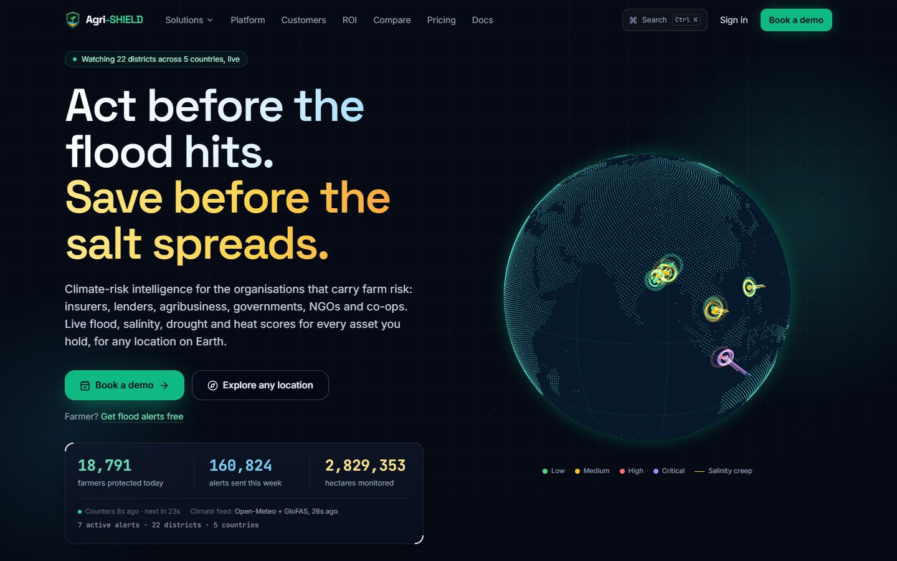

</div>

---

Agri-SHIELD is a multi-tenant **climate-risk SaaS platform** that turns live weather forecasts, river-flow models, satellite imagery and machine learning into decisions people can act on. It targets the two hazards that destroy the most crops in South and Southeast Asia, **flooding** and **saltwater intrusion**, along with drought, heat and cyclones.

Each customer gets a workspace built around their own job:
- an insurer prices and monitors crop cover;
- a bank adjusts credit risk;
- an NGO releases cash before a flood;
- a government dispatches pumps;
- a trader reroutes grain;
- a farmer knows whether to irrigate or harvest today.

They all share one risk engine that works **for any location on Earth**.

Everything runs on **free and open data** (Open-Meteo, Copernicus GloFAS and ERA5, NASA, NOAA, GDACS, FAO, the World Bank and more), so the whole platform works end to end without a single paid API key.

> Built by **Nitya Prakash Pandey** for the Asian Hackathon for Green Future 2026 (Water Resources & Climate-Resilient Agriculture), and designed to grow into a commercial product.

---

## Contents

- [Product tour](#-product-tour)
- [Who it's for](#-who-its-for)
- [Modules](#-modules)
- [Real data, no paid keys](#-real-data-no-paid-keys)
- [Science & machine learning](#-science--machine-learning)
- [Architecture](#-architecture)
- [Quick start](#-quick-start)
- [Demo accounts](#-demo-accounts)
- [APIs & integrations](#-apis--integrations)
- [Security](#-security)
- [Testing & quality](#-testing--quality)
- [Deployment](#-deployment)
- [Project status & roadmap](#-project-status--roadmap)
- [Author & license](#-author--license)

---

## 🛰 Product tour

<table>
  <tr>
    <td width="50%">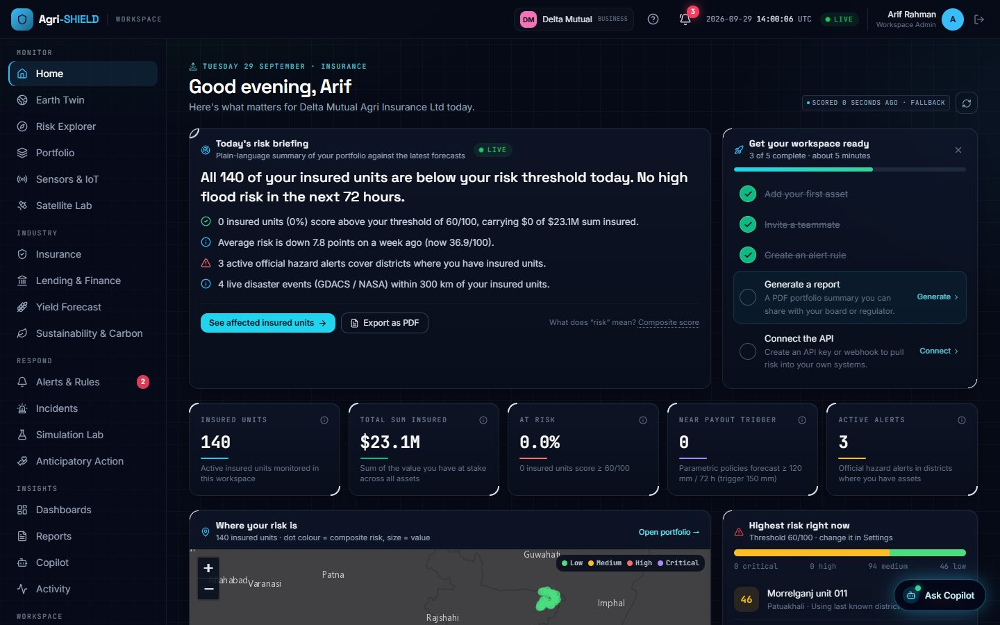<br/><b>Workspace home:</b> a plain-language risk briefing written from the portfolio's live scores, with industry-specific KPIs and a setup checklist.</td>
    <td width="50%">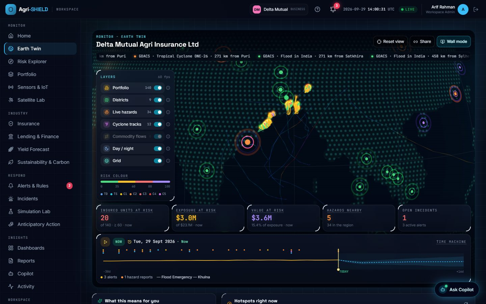<br/><b>Earth Twin:</b> a 3D mission-control globe with assets as risk-coloured pillars, live hazards, 179 real cyclone tracks, a −30 → +16 day time machine and an ops-room wall mode.</td>
  </tr>
  <tr>
    <td>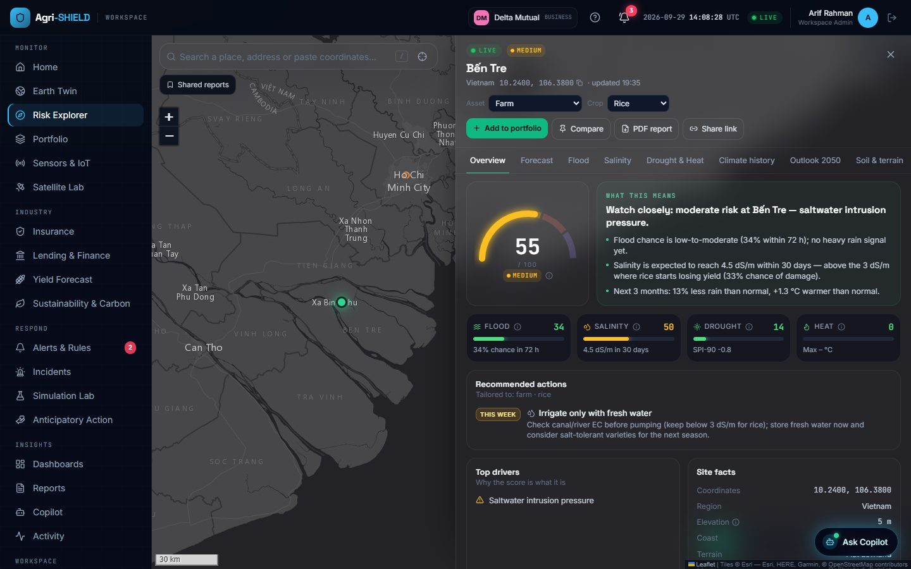<br/><b>Risk Explorer:</b> climate due-diligence for any place on Earth, covering ML flood and salinity, ensemble forecast, 40-year history, 2050 outlook, soil and terrain, all explained in plain words.</td>
    <td>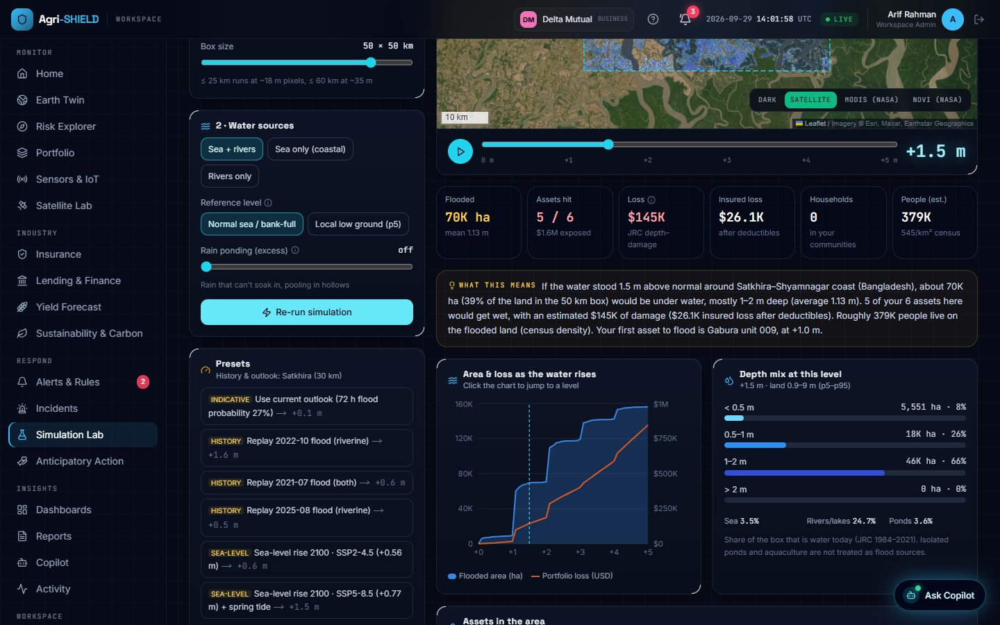<br/><b>Simulation Lab:</b> "what if the water rose 1.5 m?", modelled on a real elevation model with flooded area, assets hit, losses and people affected.</td>
  </tr>
  <tr>
    <td>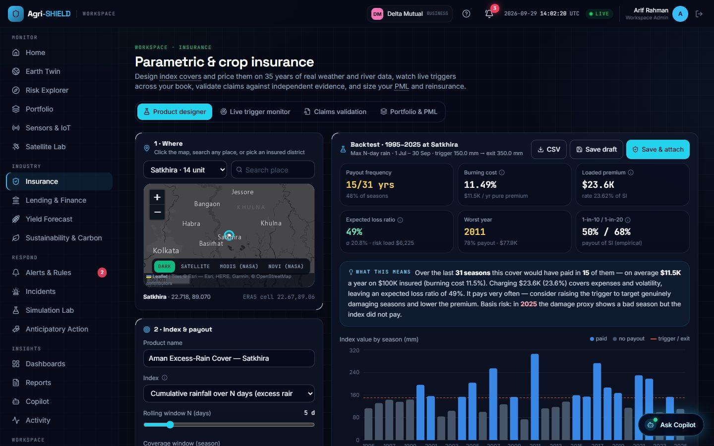<br/><b>Parametric insurance:</b> design a weather-index cover and backtest it on 30+ years of real weather, with burning cost, loss ratio and basis risk.</td>
    <td>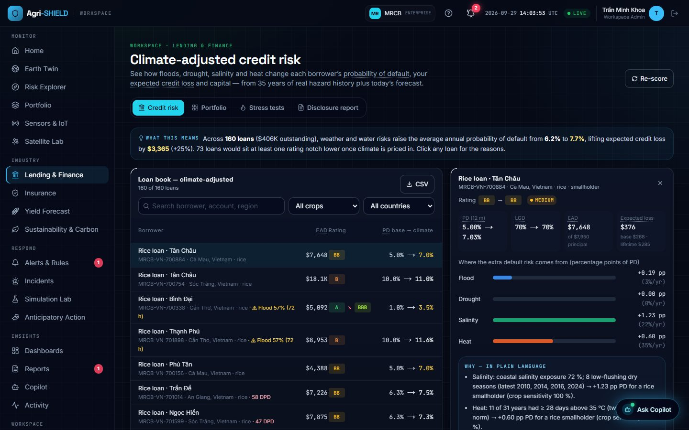<br/><b>Lending & finance:</b> climate-adjusted PD and expected loss for every loan, stress tests and a physical-risk disclosure report.</td>
  </tr>
  <tr>
    <td>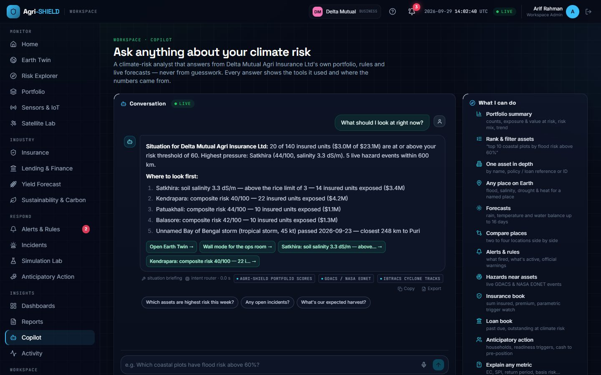<br/><b>Copilot:</b> ask "what should I look at right now?" and get answers built only from your own data, as text, tables, maps and charts.</td>
    <td>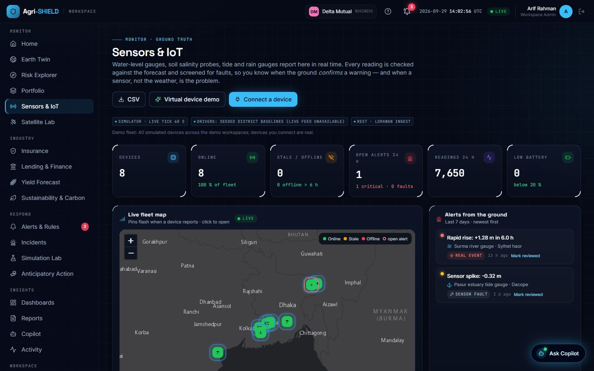<br/><b>Sensors & IoT:</b> river gauges and soil probes over REST or LoRaWAN; it tells a real flash flood apart from a broken sensor.</td>
  </tr>
  <tr>
    <td>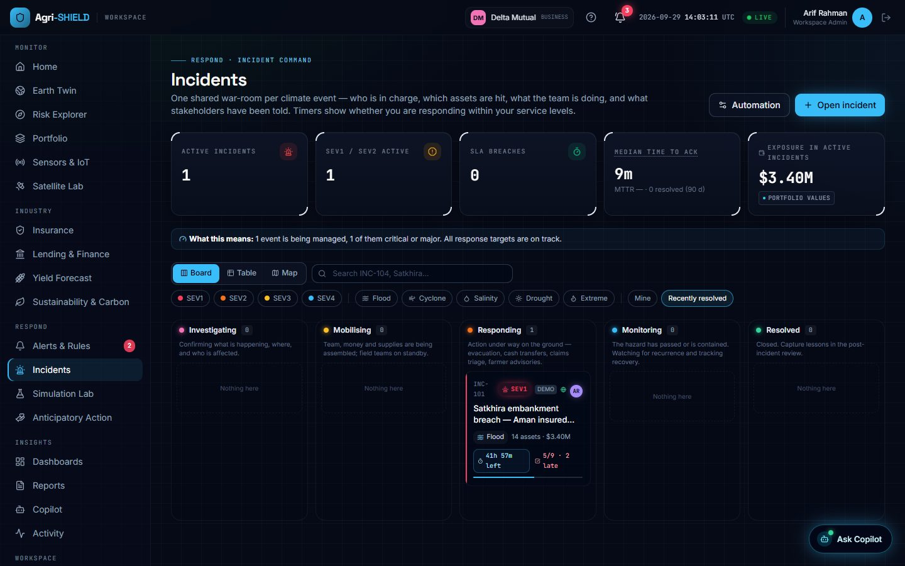<br/><b>Incident command:</b> SEV1–4 incidents with war-rooms, task templates, SLA timers, @mentions, live presence and a public status page.</td>
    <td>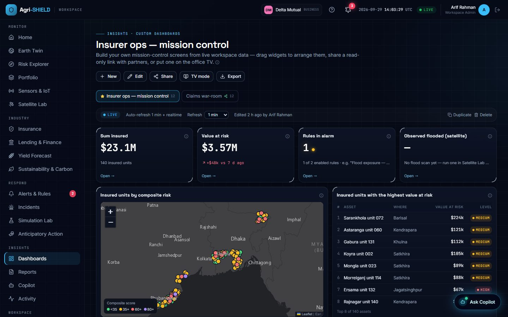<br/><b>Dashboards:</b> drag-and-resize mission-control screens over live metrics, with share links and TV mode.</td>
  </tr>
  <tr>
    <td>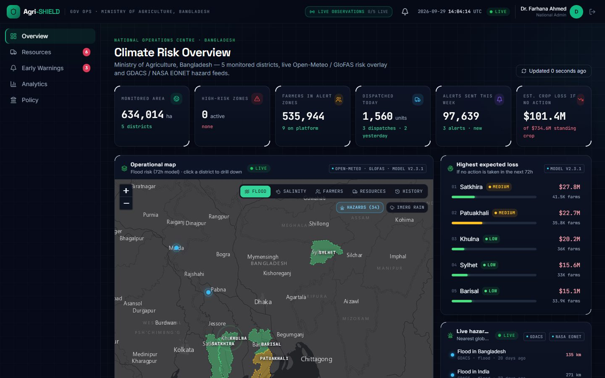<br/><b>Government command:</b> district risk on real admin boundaries, resource dispatch, early-warning broadcasts and policy tools.</td>
    <td align="center">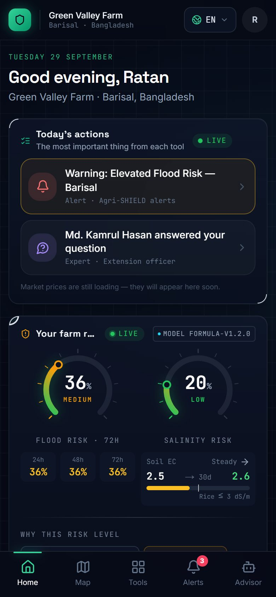<br/><b>Farmer app:</b> a mobile, offline-capable PWA in 8 languages covering irrigation, planting, market prices, crop doctor and an AI advisor.</td>
  </tr>
</table>

---

## 🎯 Who it's for

| Customer | The job | What Agri-SHIELD gives them |
| --- | --- | --- |
| **Agri insurers** | Price, monitor and settle crop cover | Parametric product designer backtested on real history, live trigger monitor, satellite and reanalysis **claims validation**, PML and reinsurance layers |
| **Banks & MFIs** | Lend to farmers without taking blind climate risk | Climate-adjusted **PD / LGD / expected loss** per loan, early-warning watchlists, stress tests, TCFD / IFRS S2 disclosure |
| **NGOs & humanitarian agencies** | Act before disasters, not after | Forecast-based **anticipatory action** triggers, backtested hit rates, pre-arranged cash planning and an activation workflow |
| **Governments** | Protect districts and dispatch resources | District risk command centre, resource dispatch, multi-channel **early-warning broadcasts**, analytics and policy briefs |
| **Agribusiness & traders** | Secure supply and prices | Supply-chain network risk, commodity outlooks, Monte Carlo disruption scenarios, alternative suppliers |
| **Farmer co-operatives** | Help members farm through climate stress | Member-farm monitoring, yield outlook, rice **carbon (AWD) programme**, field sensors |
| **Farmers** | Know what to do today | Mobile app in 8 languages: flood and salinity alerts, irrigation and planting advice, real market prices, crop doctor, insurance enrolment, plus an **SMS bot for feature phones** |

---

## 🧩 Modules

**Monitor**
- **Earth Twin:** a 3D globe with instanced asset pillars, real district boundaries, live GDACS/NASA hazards, IBTrACS cyclone tracks, commodity flows, a real day/night terminator, a time machine and a wall mode.
- **Risk Explorer:** a full report for any coordinate. It covers flood (ML), salinity, drought (SPI) and heat (heat index and wet-bulb), a 51-member ensemble forecast, a 6-month seasonal outlook, 40-year ERA5 trends and return periods, a CMIP6 2050 projection, river percentiles, terrain and soil. Reports export as PDF or share links, and a free public version lives at `/explore`.
- **Portfolio:** import assets from CSV, GeoJSON or addresses. They are re-scored against live data, with value-at-risk by hazard, top movers, concentration and per-asset pages with satellite imagery and discussion threads.
- **Sensors & IoT:** device registry, REST and LoRaWAN ingest, a physically based simulated fleet, anomaly detection, forecast-vs-observed checks and a browser virtual device.
- **Satellite Lab:** before/after swipe and time-lapse of NASA imagery (30 m HLS, MODIS, VIIRS, NDVI), NDVI anomalies and an observed-flood scan of the portfolio.

**Respond**
- **Alerts & Rules:** a visual IF/THEN rule builder on forecasts *and* live sensor readings. It delivers in-app, by email, SMS or WhatsApp, and to signed webhooks and Slack, with a realtime notification centre.
- **Incidents:** SEV1–4 incident command with war-rooms, roles, hazard task templates, SLA metrics, stakeholder updates to a public status page and post-incident reviews.
- **Simulation Lab:** connectivity-aware flood inundation on a real DEM, Holland-model cyclone replays (Amphan, Remal, Fani…) and custom tracks with surge, and drought and heat yield loss, all applied to your own assets.
- **Anticipatory Action:** trigger protocols, backtests (hit rate, false alarms, lead time), cash-transfer planning and an activation workflow.

**Industry**
- **Insurance:** product designer, live trigger monitor, claims validation, book view and PML.
- **Lending & Finance:** climate-adjusted credit risk, stress tests and disclosure reports.
- **Yield Forecast:** in-season P10/P50/P90 production with drivers and weekly evolution, plus insurer and lender outlooks.
- **Sustainability & Carbon:** IPCC Tier 1 rice methane, an AWD adoption tracker, N₂O, water footprint, indicative credits, and MRV and ESG packs.

**Insights**
- **Dashboards:** widget builder, industry templates, share links, TV rotation and PNG/PDF export.
- **Reports:** board packs, portfolio summaries, due-diligence reports and disclosures, on demand or scheduled.
- **Copilot:** a tool-using assistant over the workspace's own data. It works with no API key, and uses OpenAI, Groq or a local Ollama model when one is configured.
- **Activity:** a unified realtime feed of everything happening in the workspace.

**Portals & platform**
- **Farmer app**, **Government command centre**, **Supply-chain intelligence** and **Mission control** (platform admin).
- SaaS foundations: teams and invites, plans and usage limits, API keys, a help centre with a 77-term plain-language glossary, a product tour, and `/status`, `/changelog`, `/trust`, `/developers` and `/docs` pages.

---

## 🌍 Real data, no paid keys

| Source | Used for |
| --- | --- |
| [Open-Meteo](https://open-meteo.com): forecast, ensemble, seasonal (ECMWF SEAS5), ERA5 archive, CMIP6 climate, marine, elevation, geocoding (CC BY 4.0) | Weather, uncertainty, 6-month outlook, 40-year history, 2050 projections, sea level, terrain |
| Copernicus **GloFAS v4** (via Open-Meteo) | River discharge forecasts and records |
| **NASA** GIBS (MODIS, VIIRS, HLS 30 m, IMERG, MODIS flood), EONET · **ORNL DAAC** MODIS NDVI | Satellite imagery, rainfall, observed flood extent, crop health, natural-event feed |
| **GDACS** (UN / EC JRC) · **NOAA IBTrACS** | Live disaster alerts · historical cyclone best tracks |
| **JRC** Global Surface Water · **AWS Terrain Tiles** (Terrarium) | 40-year water history · elevation model for flood simulation |
| **ISRIC SoilGrids** · **FAOSTAT** · **World Bank** (Pink Sheet & open data) | Soil properties · crop yield baselines · commodity prices & production context |
| **WFP** food prices (via HDX) · **geoBoundaries** · OpenStreetMap / Nominatim | Local market prices · real district boundaries · geocoding & rivers |
| RainViewer · MyMemory · open.er-api.com | Live radar · translation · FX rates |

The demo world is also **grounded in real data**:
- **Flood history:** ~590 real 2019–2026 flood episodes drive the alert history.
- **Boundaries and prices:** real district boundaries and World Bank prices.
- **Plausible sizes:** census-based farm sizes, loan sizes and premium rates.
- **Valid locations:** every coordinate is checked to be on land.

Sources and licences are listed in [`apps/web/server/data/real/README.md`](apps/web/server/data/real/README.md).

---

## 🔬 Science & machine learning

The **ML service** (`apps/ml-api`, FastAPI) trains on **7 years of real ERA5 reanalysis and GloFAS river discharge** for 22 districts (56k district-days).

| Model | Performance (held-out 2024–25) |
| --- | --- |
| Flood ensemble (temporal MLP + gradient boosting, bootstrap uncertainty, depth head) | **AUC 0.97** at 72 h · Brier 0.036 · F1 0.76 |
| Salinity EC regressor (now / +7 / +30 / +90 days) | **R² 0.87** at +30 d · RMSE 1.03 dS/m |
| AI farm advisor | Retrieval over 34 agronomy guides (FAO, IRRI, national extension), pluggable LLM, grounded local composer |
| Supply-chain impact | Monte Carlo loss distributions with FAO crop-loss curves |

Established methods used across the platform:
- **Water and yield:** FAO-56 water balance, FAO-33 yield response (Ky), FAO-29 salt tolerance.
- **Climate statistics:** Gumbel return periods, SPI drought index, NOAA heat index, Stull wet-bulb.
- **Hazard models:** Holland (1980) cyclone wind fields, JRC depth-damage curves.
- **Emissions:** IPCC 2019 Tier 1 rice methane and N₂O.
- **Risk:** Maas–Hoffman salinity damage, Basel-style expected loss (PD × LGD × EAD).

Methodology and honest limitations are documented in-app at `/docs` and in [`apps/ml-api/README.md`](apps/ml-api/README.md). For example, the salinity training target is semi-synthetic because no free API provides salinity ground truth.

---

## 🏗 Architecture

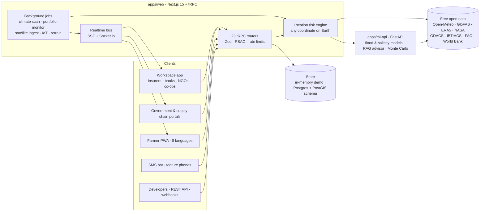

| Layer | Technology |
| --- | --- |
| Web | Next.js 15 (App Router) · React 19 · TypeScript (strict) · Tailwind CSS · Framer Motion |
| API | tRPC v11 (streamed batches, superjson) · REST `/api/v1` with OpenAPI 3.1 · Zod everywhere |
| Maps & 3D | Leaflet · three.js / react-three-fiber · d3 · Recharts |
| Auth & security | NextAuth v5 · phone OTP · TOTP 2FA · OIDC SSO · RBAC + custom roles |
| ML service | FastAPI · scikit-learn · numpy / pandas · TF-IDF retrieval |
| Data | In-memory store for demos · Drizzle ORM schema for Postgres 16 + PostGIS (30 tables, RLS policies) |
| Jobs & realtime | In-process scheduler or BullMQ + Redis · Server-Sent Events + Socket.io |
| Tooling | pnpm workspaces + Turborepo · Vitest · Playwright · pytest · GitHub Actions · Docker |

```
apps/
  web/        Next.js app: 96 pages, 23 tRPC routers, 17 API routes (~120k lines of TypeScript)
  ml-api/     FastAPI ML service: models, RAG advisor, Monte Carlo, live features
packages/
  db/         Drizzle schema, migrations and RLS policies for Postgres + PostGIS
  types/      Shared TypeScript domain types
  i18n/       en · hi · bn · vi · fil · id · ta · si
scripts/      Data builders (real reference datasets), DB seeding, icon generation, ML training
docs/         Product specification and screenshots
```

---

## 🚀 Quick start

**Prerequisites:** Node.js 20+, pnpm 9+, Python 3.12+.

```bash
git clone https://github.com/nitya-prakash-pandey-2005/Agri-Shield.git
cd Agri-Shield
pnpm install
pip install -r apps/ml-api/requirements.txt
```

Run the two services in separate terminals:

```bash
pnpm dev:ml      # ML service  → http://localhost:8000  (API docs at /docs)
pnpm dev:web     # Web app     → http://localhost:3000
```

No `.env` is required. Copy [`.env.example`](.env.example) to `.env` only to enable optional integrations: LLM providers, Twilio SMS/WhatsApp, Resend email, Stripe/Razorpay, DeepL, Postgres/Redis, or a commercial Open-Meteo key.

> **Scenario drills.** Real weather is often calm. To watch the platform respond to a disaster, sign in as `admin@demo.agrishield.io` and open **Admin → Scenario Control → Monsoon surge / Cyclone landfall / Dry-season salinity**. The drill is layered on top of live observations and every module reacts: alerts fire, incidents open and losses update.

> **Data quotas.** The free Open-Meteo tier allows ~10,000 location-calls per day per IP. Agri-SHIELD budgets its background jobs to fit, pauses a provider after HTTP 429 and falls back to cached or climatological values. For production, set `OPEN_METEO_API_KEY`.

Optional database:

```bash
docker compose up -d postgres redis
pnpm db:setup        # migrations + row-level security + seed (incl. 90 days of ERA5 readings)
```

---

## 👤 Demo accounts

Every account uses password **`demo2026`** except the farmer, who signs in with OTP **`123456`**. The sign-in page also has one-click demo buttons.

| Persona | Email | Try this |
| --- | --- | --- |
| Agri insurer (Delta Mutual) | `insurer@demo.agrishield.io` | 140 group policies, ~44,500 farmers, $23M insured → **Insurance**, **Earth Twin**, **Simulation Lab** |
| Rural bank (MRCB) | `bank@demo.agrishield.io` | 160 agri loans → **Lending & Finance**, **Yield Forecast** |
| NGO (Delta Resilience Foundation) | `ngo@demo.agrishield.io` | 48 coastal communities → **Anticipatory Action**, **Incidents** |
| Farmer co-operative (Mahanadi FPC) | `coop@demo.agrishield.io` | 90 member farms → **Sustainability & Carbon**, **Sensors** |
| Agribusiness (AsiaGrain) | `supply@demo.agrishield.io` | Supply-chain portal + workspace |
| Government (Bangladesh) | `gov@demo.agrishield.io` | National operations centre |
| Farmer | `farmer@demo.agrishield.io` or any mobile number | Mobile farmer app (OTP `123456`) |
| Platform admin | `admin@demo.agrishield.io` | Mission control, scenario drills |

New organisations can sign up at `/auth/signup` → **Organisation workspace** and get a 14-day Business trial.

---

## 🔌 APIs & integrations

- **REST API:** `/api/v1/risk`, `/health`, `/supply-chain/commodity-risk`, `/alerts/webhook`, `/sms/inbound` and `/telemetry` (plus LoRaWAN). The OpenAPI 3.1 spec is at `/api/v1/openapi.json`.
- **Developer portal:** the public `/developers` page and an in-app **API explorer** (live requests with your key), per-key usage graphs, a webhook inspector and sandbox keys.
- **Webhooks:** HMAC-SHA256 signed (`X-AgriShield-Signature`), with Slack incoming-webhook support.
- **ML API:** `/api/ml/flood-risk`, `/salinity-risk`, `/advisor`, `/supply-chain/scenario`, `/metrics` and `/retrain`. Interactive docs are at `:8000/docs`.
- **Messaging:** Twilio SMS and WhatsApp, Resend email, and an in-app outbox when no keys are set.

---

## 🔒 Security

- **Sign-in:**
  - Two-step verification with authenticator apps (RFC 6238, recovery codes); admins can make it mandatory.
  - OIDC single sign-on (PKCE, JWKS signature checks, just-in-time provisioning), with a built-in mock identity provider for demos.
- **Access control:**
  - Server-side sessions with instant revoke.
  - Role-based access with 9 roles plus custom roles.
  - Per-workspace IP allow-lists.
- **Protection:**
  - Zod validation on every input, rate limiting, and strict CSP/HSTS headers.
  - API keys stored only as hashes, signed webhooks and SSRF guards.
  - Audit log with export, and a public trust page at `/trust`.

---

## ✅ Testing & quality

```bash
pnpm --filter @agri-shield/web test        # 733 Vitest tests across 51 files
pnpm test:ml                               # 68 pytest tests (models, API, RAG, Monte Carlo)
pnpm --filter @agri-shield/web test:e2e    # Playwright journeys (farmer, government, admin, landing, PWA)
```

TypeScript runs in strict mode with zero errors, and the production build compiles all 128 routes. CI (`.github/workflows/ci.yml`) runs type-checking, both test suites, the production build and the Docker image build on every push.

---

## ☁️ Deployment

The repository includes:
- `vercel.json` for the web app.
- `apps/web/Dockerfile` and `apps/ml-api/Dockerfile`.
- `docker-compose.yml` (web, ML, Postgres/PostGIS, Redis and an optional worker).
- `.github/workflows/deploy.yml` (Vercel + Railway, gated on secrets).

---

## 🧭 Project status & roadmap

Agri-SHIELD is a **working, end-to-end product demo**. Next steps toward production:

- [ ] Wire the app to Postgres/PostGIS. The schema, migrations and RLS already exist; demo state is currently in memory and resets on restart.
- [ ] Commercial data tier (`OPEN_METEO_API_KEY`) and caching infrastructure for large portfolios.
- [ ] Server-sent push notifications (FCM / Web Push) and an MQTT broker for sensors.
- [ ] Model governance with MLflow, plus a photo-based crop disease model.
- [ ] Lighthouse and accessibility audit, observability (Sentry / PostHog) and load testing.
- [ ] Partner validation of the credit, insurance and carbon estimates. The app clearly labels these as indicative.

---

## 👤 Author & license

Designed and built by **Nitya Prakash Pandey**.

Released under the [MIT License](LICENSE) © 2026 Nitya Prakash Pandey. Third-party data remains under its own licences (see [data sources](apps/web/server/data/real/README.md)).
